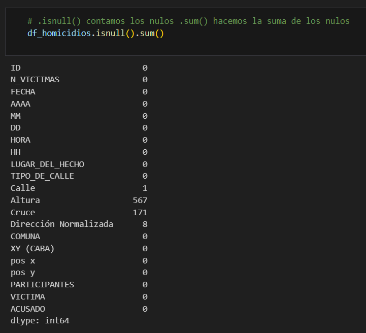
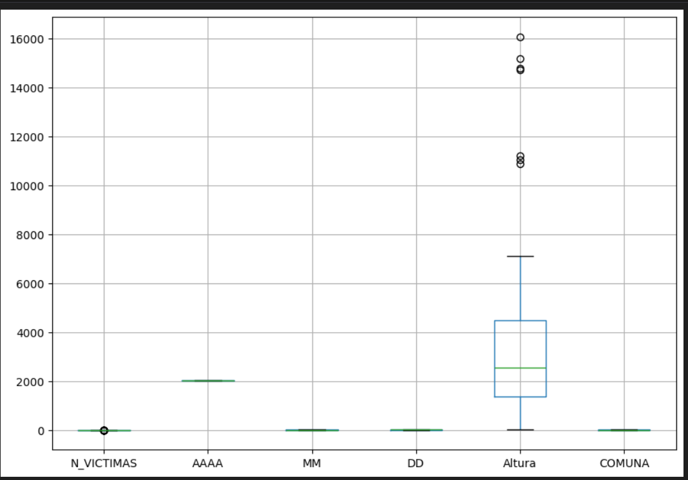
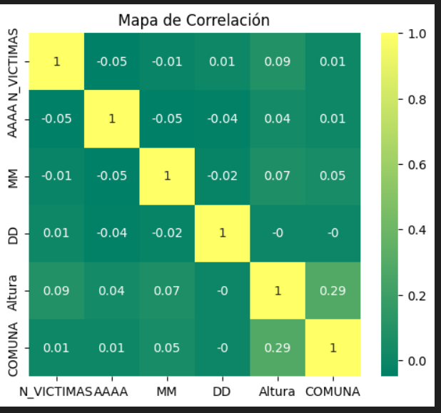
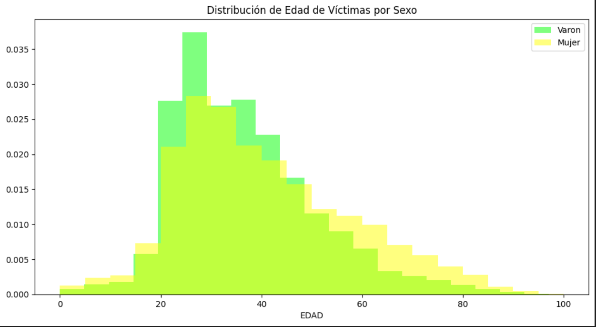
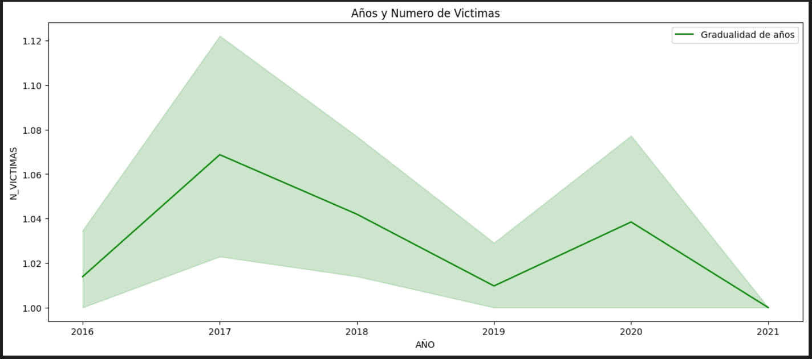
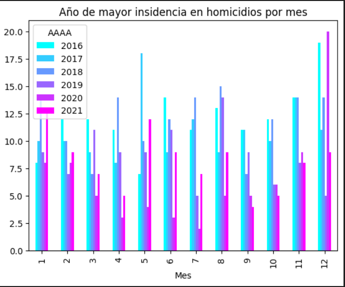

# README

# PI 2: Siniestros Viales en la Ciudad de Buenos Aires

## **Tabla de Contenidos**

- Tecnologias Usadas
- Links
- Introducción
- Contexto
- Descripcción del problema
- Desarrollo del proyecto
    - EDA
    - Dashboard
- KPI
    -Tasa Homicidios
    -Accidentes Motocicletas
    -Accidentes Bicicletas
- Conclusión
- Bibliografias
- Disclaimer
- Contacto

## **Tecnolgías usadas**

## **Links**
- [Data Original](./Data_Original/)
- [CVS](./CSV/)
- [Motor SQL](./Motor_SQL/)
- [Sources](./Sources/)

## Introducción
En la vasta red de calles y carreteras de Buenos Aires, los siniestros viales son una preocupación constante. Estos eventos, que van desde colisiones entre vehículos hasta atropellos, representan una amenaza para la seguridad de los residentes y visitantes de la ciudad. La gravedad de este problema se refleja en las estadísticas, que muestran un alto número de víctimas fatales cada año.
Los mismos constituyen una problemática significativa en Argentina, donde cada año pierden la vida alrededor de 4.000 personas, los cuales tienen un gran impacto en la seguridad de sus habitantes y en la infraestructura vial.

## Contexto
El Gobierno de la Ciudad Autónoma de Buenos Aires ha creado el Observatorio de Movilidad y Seguridad Vial (OMSV) con el objetivo de analizar y comprender la situación actual en materia de seguridad vial, así como elaborar informes y reportes relativos a la movilidad en la ciudad. El OMSV se basa en datos policiales y elabora estadísticas sobre siniestros viales, incluyendo lesiones culposas y homicidios culposos. La principal fuente de información sobre siniestros viales con víctimas fatales en la ciudad es la Subsecretaría de Seguridad Comunal e Investigación Criminal del Ministerio de Justicia y Seguridad.

## Descripcción del Problema 
El Observatorio de Movilidad y Seguridad Vial de la Ciudad de Buenos Aires ha solicitado la elaboración de un proyecto de análisis de datos para abordar esta problemática. Su objetivo es proporcionar información detallada que permita a las autoridades locales tomar medidas concretas para reducir el número de víctimas fatales en siniestros viales. Para ello, se ha proporcionado un conjunto de datos sobre homicidios en siniestros viales ocurridos en la ciudad durante el período 2016-2021.

El equipo asignado deberá analizar este conjunto de datos y extraer información relevante que pueda servir como base para la implementación de políticas y acciones preventivas. Además, se espera que el equipo utilice los recursos proporcionados por el Observatorio, como el material de apoyo y los diccionarios de datos, para comprender completamente el contexto y las variables involucradas en los siniestros viales.

En resumen, se espera que el equipo desarrolle un análisis exhaustivo de los datos proporcionados, identifique tendencias y patrones significativos, y formule recomendaciones concretas para mejorar la seguridad vial en la ciudad de Buenos Aires. Este proyecto tiene como objetivo contribuir a la reducción de las tasas de mortalidad relacionadas con siniestros viales y mejorar la calidad de vida de sus habitantes.

## Desarrollo del Proyecto
-**EDA:**  
En el EDA realizaremos un análisis exploratorio de los datos proporcionados, centrándonos en varios aspectos clave como la búsqueda de valores faltantes, valores atípicos o outliers, registros duplicados y la utilización de gráficos adecuados para la visualización de las diferentes variables.

- Búsqueda de Valores Faltantes:
Comenzamos nuestro análisis exploratorio verificando la presencia de valores faltantes en nuestro conjunto de datos. Utilizamos métodos como isnull() para identificar las celdas con valores faltantes y calculamos el porcentaje de valores faltantes en cada columna.

</img>

(Se muestra el filtrado de los null)

- Detección de Registros Duplicados:
Se verifican los registros duplicados en nuestro conjunto de datos utilizando la función duplicated().

- Identificación de Valores Atípicos (Outliers):
Se explora la presencia de valores atípicos en nuestras variables numéricas utilizando métodos como el diagrama de caja (boxplot) y el cálculo de los percentiles.

</img>

(Se ralizo un bloxplot, en el cual nos muestra que hay anomalias en N_VICTIMAS Y Altura)

- Visualización de Datos:
Utilizamos diferentes tipos de gráficos según la naturaleza de las variables, como histogramas para variables numéricas y gráficos de barras para variables categóricas, con el objetivo de comprender mejor la distribución y la relación entre las variables.

</img>

(Representa las relaciones entre las variables numéricas de tu dataset, que incluye N_VICTIMAS, COMUNA, Altura y MM.)

</img>

(Podemos ver la distribucion de los datos con forme a la edad y el sexo de las victimas involucradas)

</img>

(Se hace un grafico de linea en el cual podemos ver como los numero de victimas aumentan o disminuyen al pasar los años)

</img>

(El grafico nos ayuda a ver los años y los meses con mayor insidencia de homicidios. Por lo que podemos determinar)

Este EDA constituye un entregable valioso en sí mismo, proporcionando una comprensión sólida de nuestro conjunto de datos y sentando las bases para análisis más avanzados.
[EDA](https://github.com/MFLopezBello/PI-2.-Siniestros-Viales/blob/main/EDA.ipynb)

-**Dashboard:**
El dashboard fue desarrollado en Power BI el cual es interactivo, cuenta con una variedad de filtros, gráficos claros y coherentes que facilitan la interpretación de la información y su análisis. Se diseño cada elemento del dashboard con el objetivo de proporcionar una experiencia intuitiva y funcional para el usuario. 
Los filtros permiten explorar detalladamente los datos seleccionando y diferentes variables. La claridad en la presentación de los datos, la estética visual y la elección coherente de los gráficos según las variables a visualizar son aspectos clave que se han tenido en cuenta en el diseño de este dashboard. Es una herramienta poderosa para el análisis de datos de homicidios en siniestros viales en CABA. Esperamos que este análisis y visualización de datos ayude a las autoridades locales a tomar decisiones informadas y efectivas para mejorar la seguridad vial en la ciudad.[Dashboard](https://github.com/MFLopezBello/PI-2.-Siniestros-Viales/blob/main/Siniestro%20Viales%20P2.pbix)

## KPI 
-Reducción de la Tasa de Homicidios en Siniestros Viales en CABA:
El objetivo de esta KPI es reducir en un 10% la tasa de homicidios en siniestros viales durante los últimos seis meses en la Ciudad Autónoma de Buenos Aires (CABA), en comparación con la tasa del semestre anterior.La tasa de homicidios en siniestros viales se define como el número de víctimas fatales en accidentes de tránsito por cada 100,000 habitantes en un área geográfica durante un período de tiempo específico.

Reducir la tasa de homicidios en siniestros viales no solo implica salvar vidas, sino también mejorar la calidad de vida de los habitantes de CABA y promover un entorno vial más seguro y sostenible. Este KPI refleja el compromiso de las autoridades y las organizaciones pertinentes con la protección de los ciudadanos y la reducción de los riesgos asociados con el tráfico vehicular.
[KPI](https://github.com/MFLopezBello/PI-2.-Siniestros-Viales/blob/main/Siniestro%20Viales%20P2.pbix)

-Reducción de Accidentes Mortales de Motociclistas en CABA:
El objetivo de esta KPI es reducir en un 7% la cantidad de accidentes mortales de motociclistas en la Ciudad Autónoma de Buenos Aires (CABA) durante el último año, en comparación con el año anterior.
La cantidad de accidentes mortales de motociclistas en siniestros viales se define como el número absoluto de accidentes fatales en los que estuvieron involucradas víctimas que viajaban en moto en un determinado periodo temporal.

Reducir la cantidad de accidentes mortales de motociclistas no solo contribuye a salvar vidas y prevenir lesiones graves, sino que también tiene un impacto positivo en la percepción de seguridad vial en la ciudad. Este KPI refleja el compromiso de las autoridades y las organizaciones pertinentes con la protección de todos los usuarios de la vía pública, especialmente aquellos que utilizan medios de transporte más vulnerables como las motocicletas.
[KPI](https://github.com/MFLopezBello/PI-2.-Siniestros-Viales/blob/main/Siniestro%20Viales%20P2.pbix)

-Reducción de Accidnetes Mortales de Bicicletas en CABA:
El objetivo de esta KPI es reducir en un 20% la cantidad de accidentes mortales de bicicletas en la Ciudad Autónoma de Buenos Aires (CABA) durante el último año, en comparación con el año anterior. La cantidad de accidentes mortales de bicicletas en siniestros viales se define como el número absoluto de accidentes fatales en los que estuvieron involucradas víctimas que viajaban en bic en un determinado periodo temporal.

Reducir la cantidad de accidentes mortales de bicicletas no solo contribuye a salvar vidas y prevenir lesiones graves, sino que también tiene un impacto positivo en la percepción de seguridad vial en la ciudad y en contribución al medio ambiente. La protección de todos los usuarios de la vía pública, especialmente aquellos que utilizan medios de transporte más vulnerables como son las bicieltas o los peatones, son los ciudadanos mas vulnerables ya que muchos de los accidentes que sufren no son ocacionados por imprudencia de ellos, si no de otros conductores que no toman las suficientes precauciones al estar en la via publica.
[KPI](https://github.com/MFLopezBello/PI-2.-Siniestros-Viales/blob/main/Siniestro%20Viales%20P2.pbix)

## Conclusión 
El análisis de los datos proporcionados se ha permitido identificar patrones y tendencias en los siniestros viales que han resultado en víctimas fatales en la Ciudad de Buenos Aires. A través de la exploración de las variables espaciales, temporales y participantes, se han podido identificar áreas y momentos de mayor riesgo en la ciudad.

Con ayuda del EDA podemos analizar e inviestigar el conjunto de datos y resumir sus principales caracteristicas, en el cual tambien usamos metodos de visualización de los mismos. Con ayuda de la herramienta Power BI realizamos el analisis de datos, creamos el informe de los mismos con ayuda de graficos interactivos, objetos visuales de interes que nos ayudan a resaltar los puntos mas importntes de la infromación.

Por otro lado, el análisis de las variables de las víctimas, como la edad, el sexo y el modo de desplazamiento, ha permitido identificar grupos de población más vulnerables en relación con los siniestros viales. Estos hallazgos pueden ser utilizados para diseñar programas de concientización y prevención dirigidos a estos grupos específicos.

## Bibliografia 
- [Observatorio de Movilidad y Seguridad Vial](https://buenosaires.gob.ar/movilidad/plan-de-seguridad-vial/observatorio-de-movilidad-y-seguridad-vial)
- [Bases de Víctimas Fatales en Siniestros Viales. Notas para su uso](https://cdn.buenosaires.gob.ar/datosabiertos/datasets/transporte-y-obras-publicas/victimas-siniestros-viales/NOTAS_HOMICIDIOS_SINIESTRO_VIAL.pdf)
- [Data Analytics](https://www.students.soyhenry.com/Bootcamp/modules/14)
- [DBMS, SQL, Estadísticas](https://www.students.soyhenry.com/bootcamp/modules/11)
- [Data Engineer](https://www.students.soyhenry.com/bootcamp/modules/13)
- [KPI's 4 Students](https://docs.google.com/document/d/1DI0ZVgHfOfjgnXGhi8jEKzwCIjtUdgRUDe-qiiGGq8E/edit)

## Disclaimer 
Se hace énfasis en que los proyectos presentados por el equipo de Henry tienen como único propósito el aprendizaje y la simulación de un entorno laboral, con el objetivo de abordar diversas temáticas de manera educativa. Es importante destacar que estos proyectos no necesariamente reflejan la filosofía y los valores de la organización. Asimismo, queremos dejar claro que Henry no promueve ni recomienda a los alumnos ni a ninguna persona que tome decisiones basadas en los datos recopilados en los repositorios o entregas de proyectos. La información y los resultados obtenidos en estos proyectos nunca deben ser utilizados para la toma real de decisiones, especialmente en áreas como finanzas, salud o política.

## Contacto

  
  
  

